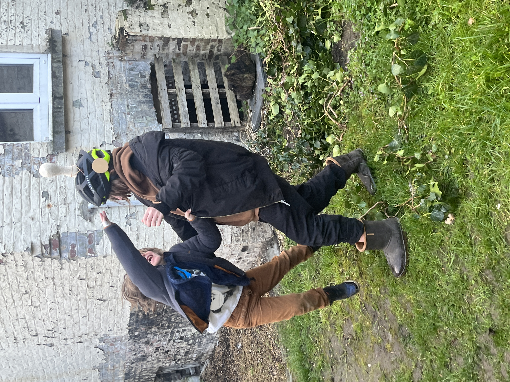
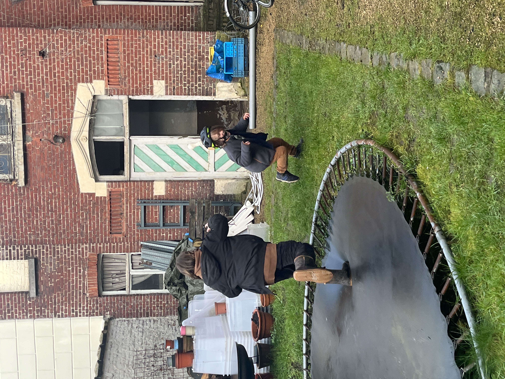
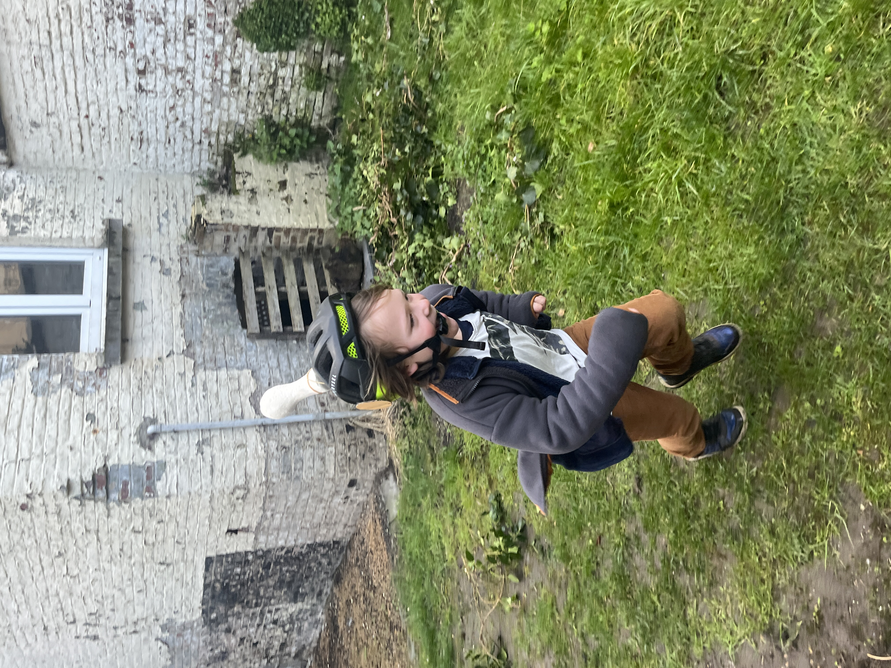
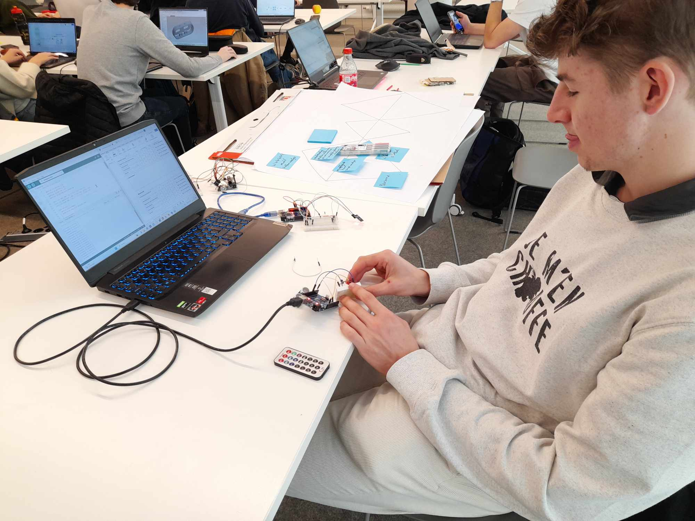
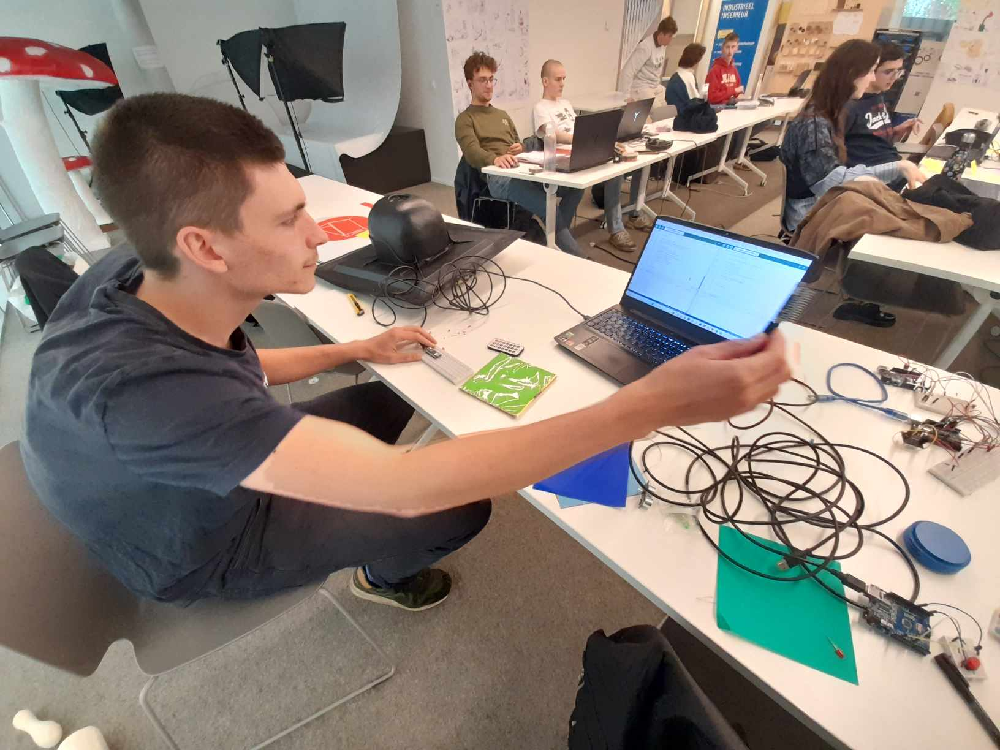
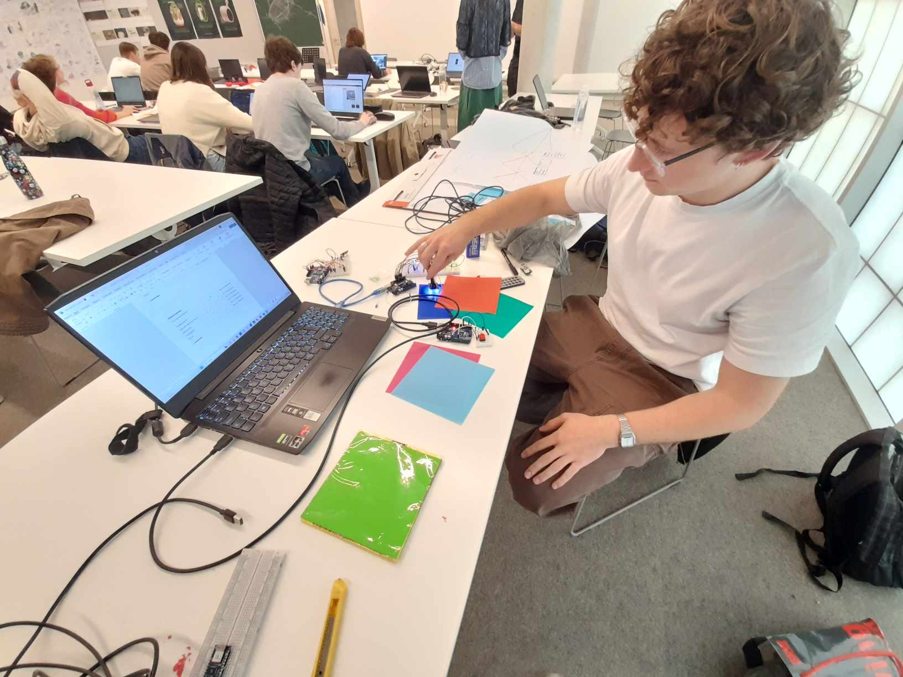

# deelopdracht 4: develop 2

*Kampkode: Robbe de Guytenaer; Kai Cherchye*

## Onderzoeksvragen
- Wat zijn de problemen die optreden bij onze huidige concepten van uitschakelmechanismes?
- Welke uitschakelmechanismes zijn het meest geschikt voor ons product?
- Welke mogelijkheden hebben we bij de digitale uitschakelmechanismes?

## Gebruikerstest (n = 4)
### Doestellingen
Bij deze gebruikerstest willen we de huidige concepten van uitschakelmechanismes testen zodat we de voor- en nadelen kunnen vergelijken en eventueel al bepaalde mechanismes kunnen uitsluiten.
### Materiaal & methoden
Op voorhand worden vier concepten voor de uitschakelmechanismes bedacht:
1. uitschakelen door slaan op flexibele lamp
2. magnetische lamp van helm trekken
3. binnen bepaalde radius in de buurt komen
4. mikken met pointer op sensor van helm

Voor elk concept wordt een simpel prototype bedacht en een manier om het concept te testen. Na de test van elk concept krijgen de testpersonen een invulblad waarbij ze het volgende op een schaal van 1 tot en met 10 moeten beoordelen: leukheid, veiligheid, gemakkelijkheid. De specifieke vragen zijn:

- Hoe leuk vond je deze manier van uitschakelen?
- Hoe gemakkelijk ging het om uit te schakelen/uitgeschakeld te worden?
- Is het spel veilig verlopen?

Robbe en Kai vullen het blad ook zelf in, op basis van wat zij observeren tijdens de test. Achteraf worden de verschillende scores samengelegd en wordt geëvalueerd welke uitschakelmechanismes het beste werken.

Voor meer informatie en een uitgebreid testprotocol [klik hier](https://docs.google.com/document/d/1BkApIH-f38Q3cW6vv41kQgkfSpGxI7UM/edit?usp=sharing&ouid=104947688789871349253&rtpof=true&sd=true).

  
  
  
  

### Resultaten
Een uitgebreide testanalyse/-rapport is [hier](https://docs.google.com/document/d/11eM8duXbH3rawkLGtEZsMN7NXjgnw0J47GiqyqHjih0/edit?usp=sharing) te vinden.

De testresultaten zijn hieronder weergegeven in een tabel:
||Mechanisme 1|Mechanisme 2|Mechanisme 3|Mechanisme 4|
|---:|:---:|:---:|:---:|:---:|
|TOTAAL|138|141|144|153|
|relatief|0,767|0,783|0,800|0,850|

In deze test werd duidelijk dat mechanisme 1 en 2 - waarbij men fysiek aan het hoofd van de tegenstander moet geraken - minder geschikt zijn wanneer er een groot hoogteverschil is tussen de spelers. Ook zijn dit de twee mechanismes waarbij de veiligheid meer in het gedrang komt, door het fysiek raken van het hoofd. Mechanisme 2 scoort hier beter dan mechanisme 1. Op zich zouden voor deze problemen ook oplossingen kunnen worden bedacht, maar het zijn zeker dingen om mee rekening te houden.

Mechanisme 3 testten we aan de hand van het klassieke 'tikken'. Hier speelde hoogte geen rol meer, enkel de snelheid van de spelers en het vermogen tot tactisch ontwijken. Grote verschillen hierin kunnen we oplossen door de helm personaliseerbaar te maken, waarbij bijvoorbeeld de radius tot anderen kan worden ingesteld. 

Mechanisme 4 gaf de testpersonen echt het gevoel van een digitaal spel. Het deed ze denken aan 'lasershooten'. In essentie zou ons product ook een vorm van lasershooten kunnen zijn, maar er zouden nog meer mogelijkheden zijn. Als we dit mechanisme willen gebruiken moeten we eerst het mechanisme echt doen werken en dan opnieuw testen zodat we zeker zijn dat het aanslaat.

### Conclusies & implicaties
Van mechanisme 1 en 2 hebben we een goed beeld hoe het spel in het echt zou verlopen. Hier zijn dus geen extra testen vereist. Mechanisme 3 en 4 hebben we proberen nabootsen omdat we de technologie nog niet hadden. Omdat deze twee de hoogste score kregen zullen we nu de technologie achter deze mechanismes uitwerken en testen in de expert review. 

De test gaf ons een beeld van hoe elk mechanisme er in de praktijk uit zou zien, en heeft veel waardevolle inzichten geleverd. De score is manier om de tevredenheid van de testpersonen in kaart te brengen maar niet volledig doorslaggevend, zeker omdat de scores ook niet zo ver van elkaar liggen en er voor elk probleem nog een oplossing kan worden bedacht. Echt concrete designbeslissingen hebben we dus niet maar we hebben wel een duidelijk idee van de volgende stappen die we moeten nemen.

## Expert review (n = 2)
### Doestellingen
Tijdens deze test streven we ernaar om de diverse sensoren te evalueren op meerdere criteria, met als uiteindelijk doel een weloverwogen conclusie te formuleren over welke sensor het meest geschikt is voor het aftiksysteem.
### Materiaal & methoden
Gebruikte materiaal: 
 - arduino uno
 - arduino nano 33 iot
 - infraroodsensor
 - infraroodzender
 - kleurensensor
 - rgb led
 - ultrasonorsensor
 - evaluatieformulier

De test werd uitgevoerd in vier delen, waarbij in elk deel een andere sensor zal worden gebruikt. Na elk deel zal het testpersoon een evaluatieformulier invullen, gebaseerd op verschillende factoren, zoals gebruiksvriendelijkheid, nauwkeurigheid, algemene gebruikservaring, robuustheid en bereik. Vervolgens is er een sectie waarin ze extra opmerkingen kunnen toevoegen over de test. Daarnaast zullen ze de sensoren rangschikken van 1 (meest toepasselijk) tot 4 (minst toepasselijk) op basis van hun ervaring bij het buitenspelen, zonder te letten op specifieke aspecten.

Op basis van de resultaten van de evaluatieformulieren zullen we richtlijnen opstellen voor welke sensor(en) verder moeten worden gebruikt in ons project.

### Resultaten

|Totaal score sensoren|Emile Delanote|Oscar Ortega Saez|Warre De Vriendt|Opsomming|
|---:|:---:|:---:|:---:|:---:|
|IR-sensor|20|22|23|65|
|Kleurensensor|21|15|22|58|
|Ultrasoonsensor|21|13|17|51|
|Bluetooth|22|22|25|69|

### Rangschikkingen sensoren

- Emile Delanote

|IR-sensor|Kleurensensor|Ultrasoonsensor|Bluetooth|
|:---:|:---:|:---:|:---:|
|3|2|4|1|

- Oscar Ortega Saez

|IR-sensor|Kleurensensor|Ultrasoonsensor|Bluetooth|
|:---:|:---:|:---:|:---:|
|1|3|4|2|

- Warre De Vriendt

|IR-sensor|Kleurensensor|Ultrasoonsensor|Bluetooth|
|:---:|:---:|:---:|:---:|
|2|3|4|1|

Resultaten zijn gebaseerd op evaluatieformulieren ingevuld door drie studenten. De Bluetooth-sensor en de infraroodsensor scoorden consistent hoog in alle tests. De Bluetooth-sensor kreeg hoge waarderingen voor gebruiksvriendelijkheid en bereik, terwijl andere aspecten een score van 3 tot 4 behaalden. De infraroodsensor scoorde over het algemeen hoog, behalve op het gebied van robuustheid.

Hoewel de kleurensensor als een interessant concept werd beschouwd, waren er enkele nadelen, zoals een beperkt bereik en onnauwkeurige kleurdetectie bij snelle bewegingen. Hierdoor werd besloten deze niet te integreren in het project.

De ultrasoonsensor scoorde over het algemeen laag bij alle testpersonen. Hoewel het interessant was om te weten hoe ver een object zich bevond ten opzichte van de speler, was het probleem dat de sensor ook niet-spelers detecteerde, waardoor het gebruik ervan in het project bemoeilijkt werd.

  
  
  

### Conclusies & implicaties

Op basis van de evaluaties zijn de Bluetooth- en infraroodsensoren geselecteerd als de meest geschikte sensoren voor integratie in het project. De aftikmethode met Bluetooth-RSSI-meting presteerde over het algemeen het beste, gevolgd door de IR-sensor, kleurensensor en als laatste de ultrasoonsensor.

De aanbeveling om verder te werken met de Bluetooth- en IR-sensoren is gebaseerd op zowel de individuele scores als de rangschikking van de sensoren door de testpersonen. Deze bevinding suggereert dat verschillende aspecten van de sensoren even belangrijk zijn voor een succesvolle integratie in het project. Door te focussen op de Bluetooth- en IR-sensoren kunnen we een gebruiksvriendelijk en nauwkeurig systeem ontwikkelen dat geschikt is voor buitenspelen.
## Bronnen
Gebruikerstest:
- [Testprotocol TEST 2](https://docs.google.com/document/d/1BkApIH-f38Q3cW6vv41kQgkfSpGxI7UM/edit?usp=sharing&ouid=104947688789871349253&rtpof=true&sd=true)
- [Analyse TEST 2](https://docs.google.com/document/d/11eM8duXbH3rawkLGtEZsMN7NXjgnw0J47GiqyqHjih0/edit?usp=sharing)
Expert Review:
- [Evaluatie formulier 1](https://acrobat.adobe.com/id/urn:aaid:sc:EU:2553d092-bdd5-44fe-9d42-5e5778c4db4d)
- [Evaluatie formulier 2](https://acrobat.adobe.com/id/urn:aaid:sc:EU:056f8e72-f52f-4371-a4a1-262baf1f0f5e)
- [Evaluatie formulier 3](https://acrobat.adobe.com/id/urn:aaid:sc:EU:5815be64-04de-4a13-ae02-c3a1e72197e6)
- [Testprotocol TEST 4](https://docs.google.com/document/d/1w61usxqKWZmartLdLhazbu1x97a9XXm4Uib38ldr-m0/edit?addon_store)
- [Analyse TEST 4](https://docs.google.com/document/d/1w61usxqKWZmartLdLhazbu1x97a9XXm4Uib38ldr-m0/edit?addon_store)
